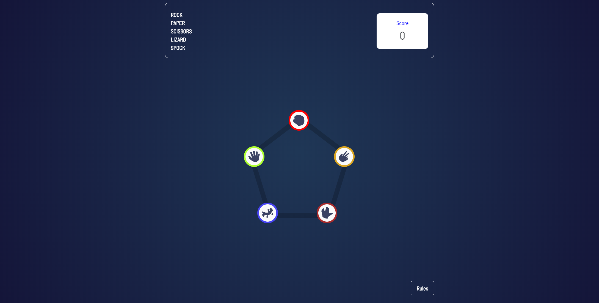
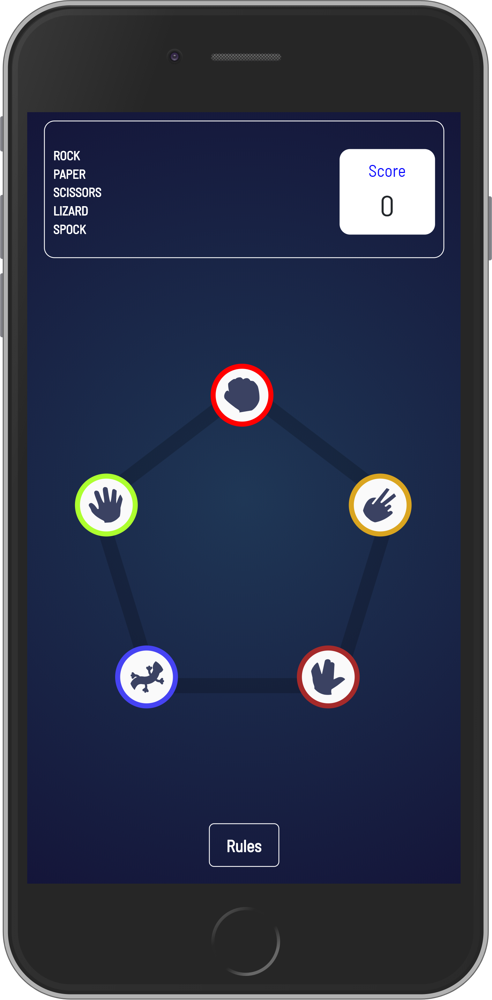

# rock-paper-scissors-lizard-spock game

To play the game, select any of the five hand-shaped items on the main-page. The winner is judged based on what is chosen in the diagram below. You get a point for each win and a deduction of point for every loss

The game is an expansion on the game Rock, Paper, Scissors. Each player picks one of the five listed options on the page and the winner is decided based on some set of rules. In a tie, the process is repeated until a winner is found.

The winner gets a point for each win and a deduction for every loss. 

The game is fully responsive on all screens and it was built using vanilla javascript, html and css.

## Screenshots

Desktop

Mobile

## Live Demo

[Hosted Link](tamsay-rock-paper-scissors-spook-lizard.netlify.app)

## Author

Longe Temitope
- Github: [@tamsay](https://github.com/tamsay)
- Twitter: [@longetope](https://twitter.com/longetope)

## 🤝 Contributing

Contributions, issues and feature requests are welcome!

Feel free to check the [issues page](https://github.com/tamsay/rock-paper-scissors/issues)

## Show your support

Give a ⭐️ if you like this project!

## Acknowledgments

Project inspired by [Frontendmentors.io](https://www.frontendmentor.io/challenges/rock-paper-scissors-game-pTgwgvgH)